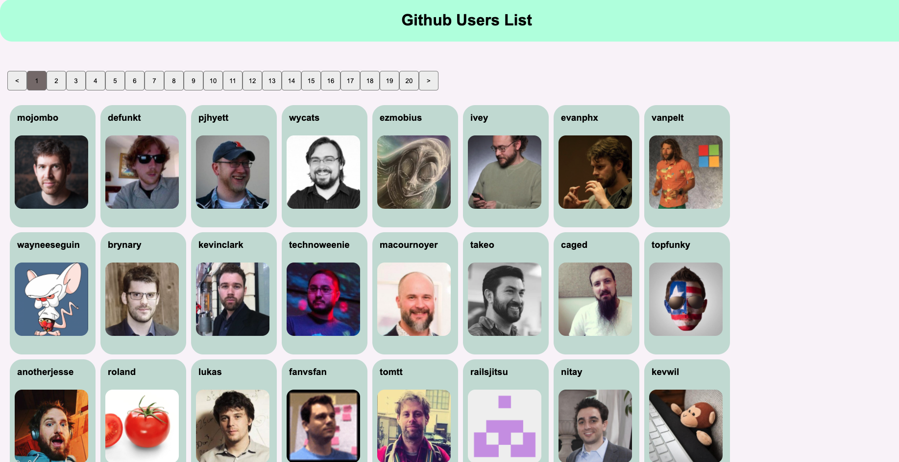

# Github User List

## demo


## Installation

run the follow command to run the application. 
```bash
npm start
```
Please go to http://localhost:1300/ to see the application.

## Tech Stack

- React
- Styled Component
- Github API
- jest
- enzyme

## Author

Chris Huang

## License

[MIT](https://choosealicense.com/licenses/mit/)
